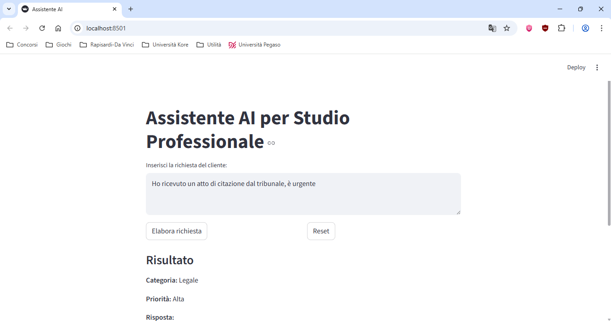
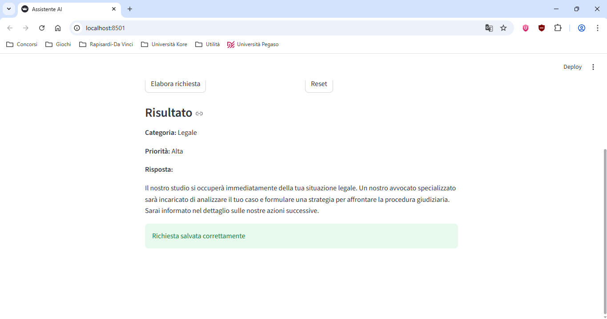

# AI Assistant for Professional Firms

This repository contains **AI Assistant for Professional Firms**, a Python-based web application that supports professional offices in managing client requests.

The application uses a local Large Language Model (via Ollama) to classify requests, assign priority levels, and generate professional responses automatically.

---

## Application Preview

### User Interface
The main interface where the user inserts the client request.



### Processing Result
Example of classification, priority assignment, and generated response.



---

## Repository Structure

```
main_repository/
│
├── assets/
│   ├── screenshot1.png
│   └── screenshot2.png
│
├── app.py
├── LICENSE
└── README.md
```

---

## Project Overview

The AI Assistant allows users to:

1. **Classify client requests automatically**  
   - Categories: Legal, Tax, Administrative  
   - Hybrid approach: rule-based + AI classification  

2. **Assign priority levels**  
   - High (urgent requests)  
   - Medium (deadline-related)  
   - Normal  

3. **Generate professional responses**  
   - Short (max 3 lines)  
   - Formal and direct  
   - No unnecessary explanations  

4. **Interact through a simple web interface**  
   - Built with Streamlit  
   - Real-time request processing  

5. **Log all interactions**  
   - Requests, categories, priorities, and responses  
   - Stored locally in a log file  

---

## Core Logic

- **Rule-Based Classification**  
  Detects keywords for more reliable categorization (e.g. legal or tax terms).

- **AI Fallback (LLM)**  
  Uses a local LLM (Llama3 via Ollama) when rules are not sufficient.

- **Prompt Engineering**  
  Carefully designed prompts ensure:
  - Italian language output  
  - Professional tone  
  - Concise responses  

- **Priority Detection**  
  Based on keywords such as "urgent" or "entro".

---

## Technologies Used

- **Python**
- **Streamlit** – Web interface
- **Requests** – API communication
- **Ollama** – Local AI model execution
- **Llama3** – Language model

---

## Installation & Setup

1. Install Python dependencies:
```bash
pip install requests streamlit
```

2. Install and run Ollama:
```bash
ollama run llama3
```
**Important:** Ollama must be installed and running locally before starting the application.  
Make sure the `llama3` model is available.

---

## Execution

From the project root folder:
```bash
streamlit run app.py
```

Then open your browser at:
http://localhost:8501

---

## Example Requests

- "Ho bisogno di assistenza per una pratica fallimentare"
- "Devo presentare la dichiarazione dei redditi"
- "Ho ricevuto un atto dal tribunale, è urgente"
- "Serve aiuto per una pratica amministrativa"

---

## Features

- Hybrid AI + rule-based classification
- Automatic priority detection
- Professional response generation
- Local logging system
- Simple and intuitive UI
- Fully local execution (no external APIs required)

---

## Notes

- The application runs entirely locally using Ollama.
- No sensitive data is sent to external services.
- The quality of responses depends on the selected model (Llama3 recommended).
- Rule-based logic improves classification accuracy for common cases.

---

## Future Improvements

- Database integration (SQLite or PostgreSQL)
- Request history dashboard
- REST API (FastAPI)
- User authentication
- Cloud deployment
- Multi-language support

---

## Author

This project was developed as a practical application of AI in professional service environments, combining automation, natural language processing, and user interface design.

---

### License

This project is licensed under the terms of the MIT license. You can find the full license in the `LICENSE` file.
